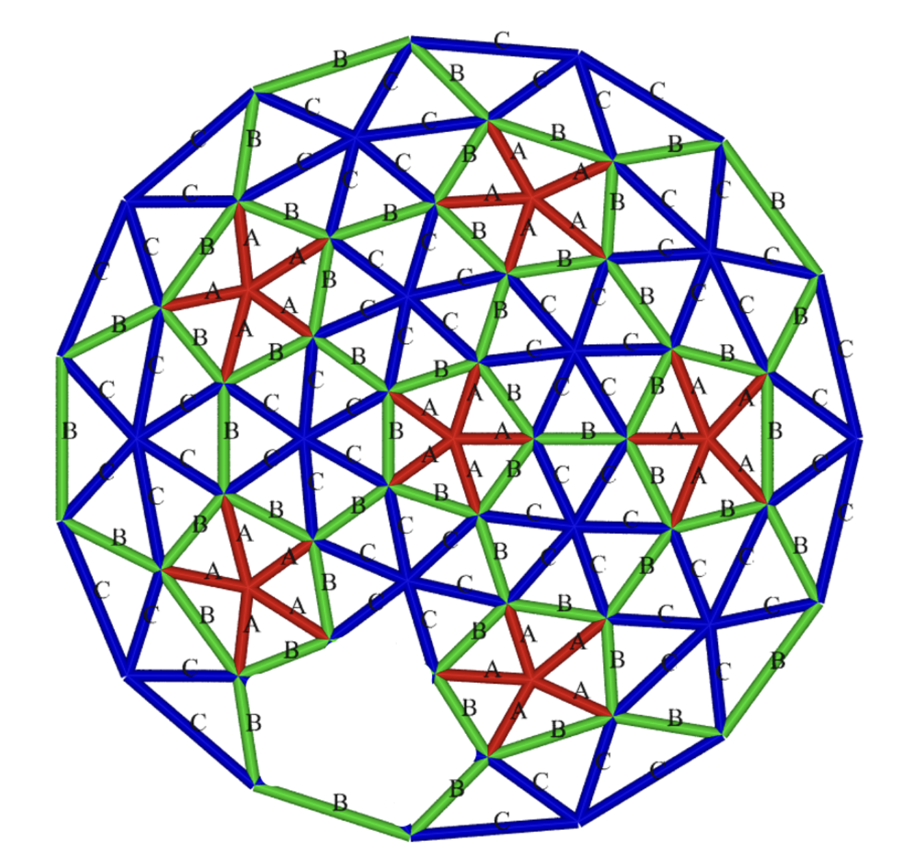
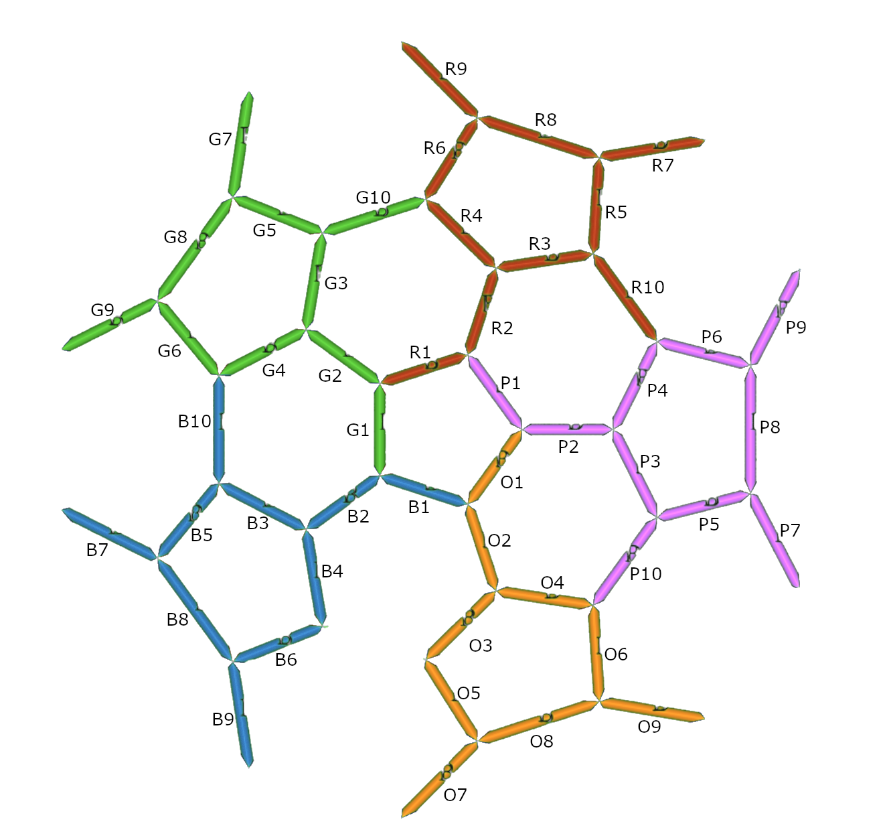

# DSK Eel

This is the classic game of snake but displayed on the inside of a geodesic dome struture.

## Features

- Support for a custom joystick device
- Game Mode displays the Eel game
- Proxy Mode allows for passthrough of ArtNet data from other sources

## Development

This game was developed using a basic Ubuntu virtual machine with go installed.

Documentation to come.

## Design Notes

Drawn below is a top-down diagram of the dome structure with segments labeled by lengths A, B, and C.

The following diagram is the above diagram with only the "B" length segments drawn. The colors are changed to help conceptualize how the Eel game is modeled.

Note: This modeling matches the way the lights are wired up.

Each of the 5 dome sections are colored separately (Blue, Red, Purple, Yellow, Green). All sections have 10 segments each except for the Blue door section which has only 9 segments.

Note that these colors are just for conceptualization and modeling but aren't otherwise meaningful.

## Author

@thommahoney for [Deep Sea Kingdom](https://deepseakingdom.com)
