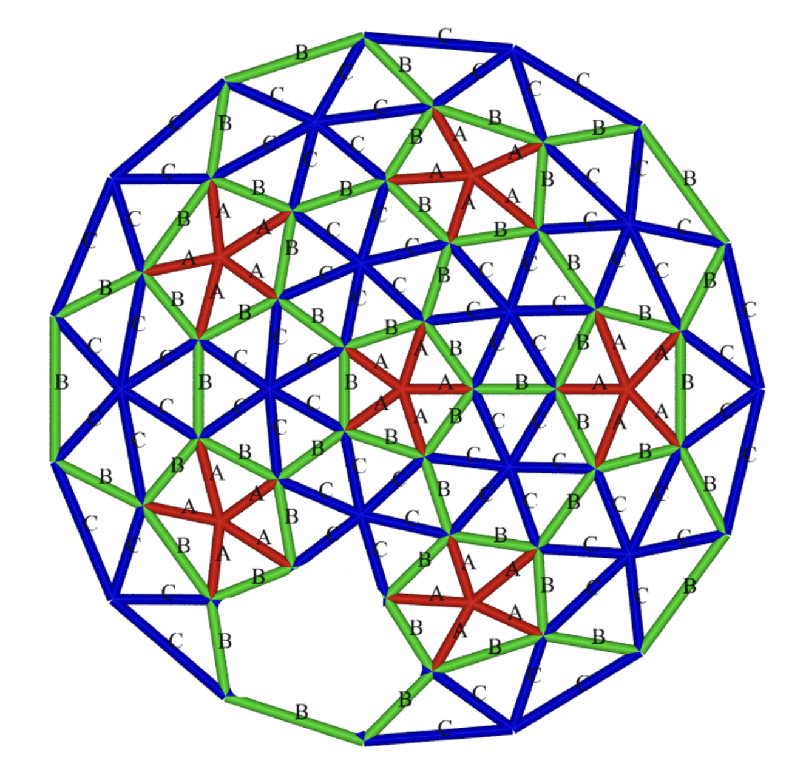

# DSK Eel

This is the classic game of snake but displayed on the inside of a geodesic dome struture.

## Features

- Support for a custom joystick device
- Keyboard control for development without the joystick (`--keyboard`)
- Game Mode displays the Eel game
- Proxy Mode allows for passthrough of ArtNet data from other sources

## Development

### Dev container

The only thing needed on the host is a container runtime with a `docker` CLI. The Go toolchain, libudev and the lint tools live in the image defined by [dev/Dockerfile](./dev/Dockerfile).

```bash
dev/run check            # build, go.mod tidiness, vet, staticcheck, gofmt and race tests
dev/run smoke            # race-instrumented demo run of the game loop
dev/run go test ./...    # any command, run in the container
dev/run                  # interactive shell
```

`dev/run` builds the image on first use and again whenever the Dockerfile changes. The checkout is mounted at `/src`, and the Go caches are kept in the `dsk-eel-dev-cache` volume. Set `GO_VERSION` to try a different toolchain, for example `GO_VERSION=1.23 dev/run check` to confirm the minimum version in `go.mod` still builds.

Every pull request and every push to `main` runs `dev/run check` and `dev/run smoke` in GitHub Actions ([.github/workflows/checks.yml](./.github/workflows/checks.yml)), in the same image, on an arm64 runner. `main` is protected: a pull request can only be merged once that `check` job has passed.

Things to know:

- The checkout, and any git worktree of it, must be somewhere the container runtime shares with its VM. With Colima's defaults that is only `$HOME`, so not `/tmp`.
- `dev/run smoke` runs the game with `--nojoy --demo` for five seconds and fails on a data race or a crash. It runs without a network, with `--ableton` pointed at loopback so the Ableton code is exercised. It does not exercise the joystick goroutine.
- Builds are for the VM's architecture (linux/arm64 on an Apple silicon Mac). The image cannot cross-compile, because go-hid needs cgo.
- Every container shares the VM's CPUs, so a build running in another checkout shifts benchmark results by 10–20%. Take before and after numbers with nothing else running, use `-count 8` or more, and compare with `benchstat old.txt new.txt`.
- `go tool pprof -top` and `-list` work; graph output (`-svg`, `-png`) needs graphviz, which is not in the image.
- Git stays on the host; the container does not see a usable repository.
- Each Dockerfile revision gets its own image tag. `docker images dsk-eel-dev` lists them, and old ones can be removed with `docker rmi`.

### Playing without the joystick

`--keyboard` reads the keyboard of the terminal the game runs in, in place of the joystick:

```bash
dev/run go run . --keyboard --chromatik <address of the machine running Chromatik>
```

| Key | Does |
|---|---|
| arrow keys | push the stick that way; it stays there until another arrow or space |
| space | centre the stick |
| `r` `g` `b` `y` `w` | the red, green, blue, yellow and white buttons |
| `q` or ctrl-C | quit |

A terminal reports that a key was pressed but not that it was let go, so this is not quite the joystick: a direction stays held, there are no diagonals, a button is a press and release in one, two buttons cannot be held together, and holding a button key down repeats the press.

- With the stick centred the eel dies at its first junction, as with the joystick, so press an arrow soon after starting. With an arrow held it never dies there, so space is also how to end a game, and with `--demo` how to hand the eel back to the demo.
- It needs a terminal on standard input, so it cannot be combined with `dev/run smoke` or run from a service. `dev/run` only passes a terminal on when its output is one too: do not pipe or redirect its standard output.
- Ctrl-Z is switched off while the game runs. If the game crashes, the terminal can be left not showing what is typed; `stty sane` puts it right.

### Native build

This game was developed using a basic Ubuntu virtual machine with go installed.

```bash
sudo apt-get install libudev-dev
# If you're on an older version of ubuntu
# sudo add-apt-repository ppa:longsleep/golang-backports
# sudo apt update
sudo apt install golang-go
go build
```

## Design Notes

Drawn below is a top-down diagram of the dome structure with segments labeled by lengths A, B, and C.




The following diagram is the above diagram with only the "B" length segments drawn. The colors are changed to help conceptualize how the Eel game is modeled.

Note: This modeling matches the way the lights are wired up.

Each of the 5 dome sections are colored separately (Blue, Red, Purple, Yellow, Green). All sections have 10 segments each except for the Blue door section which has only 9 segments.

Note that these colors are just for conceptualization and modeling but aren't otherwise meaningful.


## Author

@thommahoney for [Deep Sea Kingdom](https://deepseakingdom.com)
